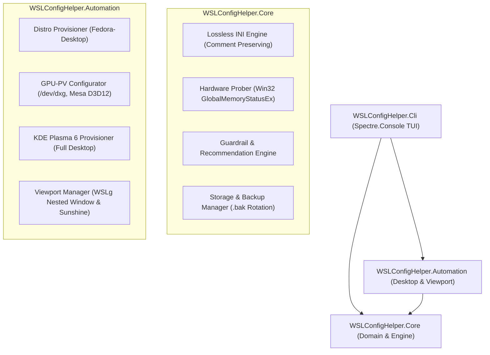

# WSLConfigHelper

<p align="center">
  <a href="LICENSE"></a>
  
  
  
  
</p>

A modern, interactive Terminal User Interface (TUI) built in **C# (.NET 10)** with **Spectre.Console** to manage your Windows Subsystem for Linux (`.wslconfig`) configuration and automate full Linux desktop experiences (KDE Plasma 6 + GPU-PV). 

Equipped with **hardware-aware guardrails**, **lossless comment-preserving INI editing**, and **single-backup rotation**, WSLConfigHelper prevents accidental host starvation while unlocking modern WSL2 virtualization features.

---

## TUI Preview

```text
┌── WSLConfigHelper v1.0 (.NET 10 | GPLv3) ──────────────────────────────────────────┐
│ Host Hardware: 16 Logical Cores, 32.0 GB Total (18.4 GB Available)                 │
│ Config Status: Saved / Synchronized        Backup (.bak): Available                │
│ Target File:   C:\Users\username\.wslconfig                                        │
└────────────────────────────────────────────────────────────────────────────────────┘

Choose an operation:
  > 1. 📊 View Current Configuration & Hardware Alignment
    2. 🩺 Run Guardrail Doctor (Diagnostics Audit)
    3. ⚡ Apply Hardware-Tuned Preset
    4. ⚙️  Edit [[wsl2]] Core Settings (Memory, vCPUs, Swap...)
    5. 🧪 Edit [[experimental]] Settings (Mirrored Net, AutoReclaim...)
    6. 🖥️  Desktop Experience & Viewport (Fedora KDE + GPU-PV)
    7. 💾 Save Changes to .wslconfig (Creates single .bak)
    8. 🔄 Restore from .wslconfig.bak
    9. 📄 View Raw INI Document
    10. 🚪 Exit
```

---

## Core Capabilities

### 🖥️ Hardware-Aware Guardrails
* **RAM Protection**: Probes physical host memory via Win32 `GlobalMemoryStatusEx`. Flags memory limits `< 2GB` (high OOM crash risk) and overallocations `> 85%` of host RAM (system thrashing/starvation).
* **vCPU Allocation**: Detects logical processors (`Environment.ProcessorCount`). Warns when all host cores are assigned without leaving scheduler headroom for the Windows host.
* **Swap Ratios**: Enforces healthy swap-to-RAM boundaries to avoid excessive disk I/O penalties.
* **Modern Virtualization Flags**: Advises on high-impact WSL2 capabilities (`sparseVhd`, `autoMemoryReclaim=gradual`, `networkingMode=mirrored`, `dnsTunneling`).

### ⚡ Dynamic Hardware Presets
Presets scale automatically to the host machine's hardware specs:

| Preset | Target RAM | Target vCPUs | Swap | Key Features Enabled |
| :--- | :--- | :--- | :--- | :--- |
| **Balanced** *(Recommended)* | 50% Host RAM | 50% Cores | 4 GB | `networkingMode=mirrored`, `dnsTunneling`, `autoProxy`, `autoMemoryReclaim=gradual`, `sparseVhd=true` |
| **Workstation** *(Power Dev)* | 75% Host RAM | Cores - 2 | 8 GB | `nestedVirtualization=true`, `guiApplications=true`, `pageReporting=true`, mirrored network & memory reclaim |
| **Resource Saver** *(Light)* | 25% Host RAM | Max 2 Cores | 2 GB | `sparseVhd=true`, `autoMemoryReclaim=gradual`, minimal host footprint |

### 📝 Lossless INI Engine
* Round-trips `%USERPROFILE%\.wslconfig` without reformatting, stripping whitespace, or deleting comments (`#` or `;`).
* Custom or undocumented keys added manually by the user are preserved intact.

### 🛡️ Single-Backup Safety
* Enforces a clean single-backup rotation policy (`.wslconfig.bak`).
* Overwrites only the previous backup before modifying the active config, avoiding backup sprawl.
* One-click restore rollback directly from the menu.

---

## Architecture & Phased Desktop Automation



### Phased Desktop Rollout
1. **Phase 1: Distro Provisioning & GPU-PV Hardware Baseline**:
   * Creates `Fedora-Desktop` WSL instance (`FedoraLinux-43`).
   * Configures systemd, dynamic linker for `/usr/lib/wsl/lib`, and Mesa D3D12 environment variables.
   * **Checkpoint 1 Debug Test**: Verifies `glxinfo -B` for direct D3D12 acceleration on the NVIDIA RTX 4080.
2. **Phase 2: Full KDE Plasma Desktop Environment**:
   * Configures `developer` user with passwordless wheel sudo.
   * Installs `@kde-desktop-environment`, PipeWire, WirePlumber, and system fonts.
   * **Checkpoint 2 Debug Test**: Verifies `kwin_wayland` and PipeWire status.
3. **Phase 3: Viewport Step 1 - WSLg Direct Nested Window**:
   * Generates `/usr/local/bin/start-plasma-wslg`.
   * Launches an interactive KDE Plasma desktop window directly onto Windows using WSLg's Wayland socket.
4. **Phase 4: Viewport Step 2 - Sunshine Low-Latency Streaming**:
   * Configures KWin's headless virtual display (`kwin_wayland --virtual`).
   * Sets up Sunshine server with PipeWire screen capture for 60–120 FPS NVENC streaming to Moonlight.

---

## Getting Started

### Prerequisites
* Windows 10 (Build 19041+) or Windows 11 with WSL2.
* [.NET 10 SDK](https://dotnet.microsoft.com/download/dotnet/10.0) (or runtime).

### Installation & Run

Clone the repository and run:
```powershell
git clone https://github.com/howaldmg/WSLConfigHelper.git
cd WSLConfigHelper
dotnet run --project src/WSLConfigHelper.Cli
```

### Command Options
```text
Usage: wslconfig-helper [options]

Options:
  -c, --config <path>   Specify a custom path to .wslconfig (default: %USERPROFILE%\.wslconfig)
  --license             Display license information (GNU GPLv3)
  -h, --help            Show help and usage information
```

### Building & Running Tests
```powershell
# Build entire solution
dotnet build

# Run automated tests (Core + Automation)
dotnet test
```

---

## Repository Structure

```
WSLConfigHelper/
├── LICENSE                               # GNU General Public License v3.0
├── README.md                             # Project documentation
├── WSLConfigHelper.slnx                  # Solution file (.NET 10 slnx format)
├── src/
│   ├── WSLConfigHelper.Core/            # Core library (Zero UI dependencies)
│   │   ├── Guardrails/                  # GuardrailEngine, PresetEngine
│   │   ├── Models/                      # Known settings catalog, MemorySizeHelper
│   │   ├── Parsing/                     # Lossless IniDocument parser and serializer
│   │   ├── Storage/                     # Atomic file service & single .bak rotation
│   │   └── SystemInfo/                  # Win32 GlobalMemoryStatusEx & CPU probes
│   ├── WSLConfigHelper.Automation/      # Desktop automation, GPU config & Viewport
│   │   ├── DistroManager.cs             # Distro provisioning & lifecycle
│   │   ├── GpuConfigurator.cs           # GPU-PV, ld.wsl.conf, Mesa D3D12 & glxinfo
│   │   ├── PlasmaProvisioner.cs         # Full KDE Plasma & user setup
│   │   ├── ViewportManager.cs           # WSLg window & Sunshine streaming
│   │   └── WslProcessRunner.cs          # Async wsl.exe process runner
│   └── WSLConfigHelper.Cli/             # Spectre.Console application
│       ├── UI/                          # Dashboard, Doctor, Preset, Editor, DesktopAutomationView
│       ├── AppController.cs             # Interactive workflow state machine
│       └── Program.cs                   # Entry point and argument parsing
└── tests/
    ├── WSLConfigHelper.Core.Tests/      # Unit tests (xUnit)
    └── WSLConfigHelper.Automation.Tests/# Automation unit tests (xUnit)
```

---

## License

This project is licensed under the **GNU General Public License v3.0 (GPL-3.0)**. See the [LICENSE](LICENSE) file for complete terms and conditions.
