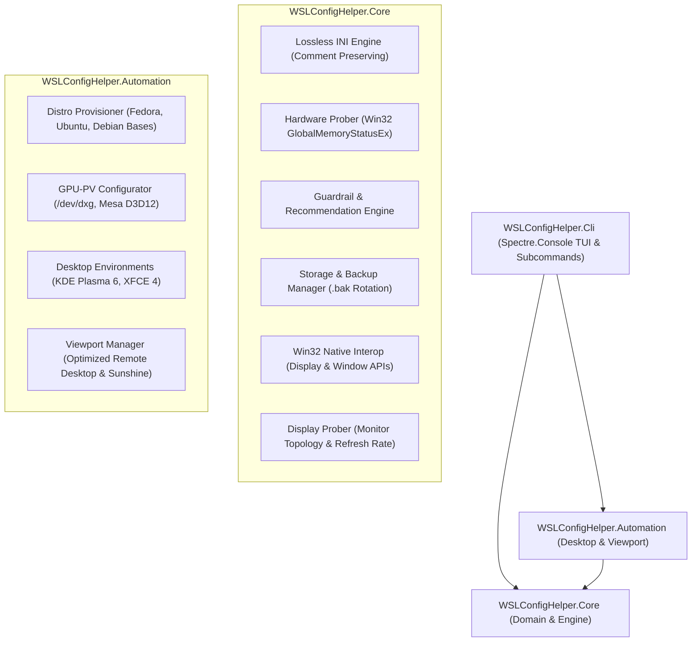

# WSLConfigHelper

<p align="center">
  <a href="LICENSE"></a>
  
  
  
  
</p>

A modern, interactive Terminal User Interface (TUI) built in **C# (.NET 10)** with **Spectre.Console** to manage your Windows Subsystem for Linux (`.wslconfig`) configuration and automate full Linux desktop experiences (KDE Plasma 6, XFCE 4 + DirectX GPU-PV). 

Equipped with **hardware-aware guardrails**, **lossless comment-preserving INI editing**, and **single-backup rotation**, WSLConfigHelper prevents accidental host starvation while unlocking modern WSL2 virtualization features.

---

## TUI Preview

```text
┌── WSLConfigHelper v1.0 (.NET 10 | GPLv3) ──────────────────────────────────────────┐
│ Host Hardware: 16 Logical Cores, 32.0 GB Total (18.4 GB Available)                 │
│ Config Status: Saved / Synchronized        Backup (.bak): Available                │
│ Target File:   C:\Users\username\.wslconfig                                        │
└────────────────────────────────────────────────────────────────────────────────────┘

Main Menu: Select an operational module
  > 1. ⚙️  WSL2 Host Configuration (.wslconfig Workbench)
    2. 🖥️  Linux Desktop Workstations & Viewports (RDP / Sunshine)
    3. 🚪 Exit
```

---

## Core Capabilities

### 🖥️ Hardware-Aware Guardrails
* **RAM Protection**: Probes physical host memory via Win32 `GlobalMemoryStatusEx`. Flags memory limits `< 2GB` (high OOM crash risk) and overallocations `> 85%` of host RAM (system thrashing/starvation).
* **vCPU Allocation**: Detects logical processors (`Environment.ProcessorCount`). Warns when all host cores are assigned without leaving scheduler headroom for the Windows host.
* **Swap Ratios**: Enforces healthy swap-to-RAM boundaries to avoid excessive disk I/O penalties.
* **Modern Virtualization Flags**: Advises on high-impact WSL2 capabilities (`sparseVhd`, `autoMemoryReclaim=gradual`, `networkingMode=mirrored`, `dnsTunneling`).

### ⚡ Dynamic Hardware Presets
Presets scale automatically to the host machine's hardware specs:

| Preset | Target RAM | Target vCPUs | Swap | Key Features Enabled |
| :--- | :--- | :--- | :--- | :--- |
| **Balanced** *(Recommended)* | 50% Host RAM | 50% Cores | 4 GB | `networkingMode=mirrored`, `dnsTunneling`, `autoProxy`, `autoMemoryReclaim=gradual`, `sparseVhd=true` |
| **Workstation** *(Power Dev)* | 75% Host RAM | Cores - 2 | 8 GB | `nestedVirtualization=true`, `guiApplications=true`, `pageReporting=true`, mirrored network & memory reclaim |
| **Resource Saver** *(Light)* | 25% Host RAM | Max 2 Cores | 2 GB | `sparseVhd=true`, `autoMemoryReclaim=gradual`, minimal host footprint |

### 📝 Lossless INI Engine
* Round-trips `%USERPROFILE%\.wslconfig` without reformatting, stripping whitespace, or deleting comments (`#` or `;`).
* Custom or undocumented keys added manually by the user are preserved intact.

### 🛡️ Single-Backup Safety
* Enforces a clean single-backup rotation policy (`.wslconfig.bak`).
* Overwrites only the previous backup before modifying the active config, avoiding backup sprawl.
* One-click restore rollback directly from the menu.

---

## Architecture & Phased Desktop Automation


```mermaid
graph TD
    CLI["WSLConfigHelper.Cli (Spectre.Console TUI & Subcommands)"] --> Core["WSLConfigHelper.Core (Domain & Engine)"]
    CLI --> Auto["WSLConfigHelper.Automation (Desktop & Viewport)"]
    Auto --> Core

    subgraph "WSLConfigHelper.Core"
        IniParser["Lossless INI Engine (Comment Preserving)"]
        Hardware["Hardware Prober (Win32 GlobalMemoryStatusEx)"]
        Guardrails["Guardrail & Recommendation Engine"]
        Storage["Storage & Backup Manager (.bak Rotation)"]
        Native["Win32 Native Interop (Display & Window APIs)"]
        Display["Display Prober (Monitor Topology & Refresh Rate)"]
    end

    subgraph "WSLConfigHelper.Automation"
        DistroMgr["Distro Provisioner (Fedora, Ubuntu, Debian Bases)"]
        GpuCfg["GPU-PV Configurator (/dev/dxg, Mesa D3D12)"]
        DesktopEnv["Desktop Environments (KDE Plasma 6, XFCE 4)"]
        ViewportMgr["Viewport Manager (Optimized Remote Desktop & Sunshine)"]
    end
```

### Phased Desktop Rollout
1. **Phase 1: Distro Provisioning & GPU-PV Hardware Baseline**:
   * Creates workstation WSL instance (default: `Fedora-KDE`).
   * Configures systemd, dynamic linker for `/usr/lib/wsl/lib`, and Mesa D3D12 environment variables.
   * **Hardware Checkpoint**: Verifies `glxinfo -B` for direct D3D12 hardware acceleration via `/dev/dxg`.
2. **Phase 2: Full Desktop Environment Installation**:
   * Configures `developer` user with passwordless wheel/sudo.
   * Installs desktop packages (KDE Plasma 6 or XFCE 4), PipeWire audio stack, and fonts.
   * Compiles hypervisor GPU vendor translation shims (`libfake_gpu.so`) so system monitors accurately measure GPU usage.
3. **Phase 3: High-Performance Desktop Viewport (Hardware-Accelerated RDP)**:
   * Tunes XRDP with `crypt_level=none`, `use_compression=no`, and `tcp_nodelay=true` for zero-overhead local hypervisor loopback streaming.
   * Automatically generates optimized `.rdp` profile (`dynamic resolution:i:1`, 32-bit true color, PipeWire audio redirection, client-side hardware cursor prediction).
   * Supports Fullscreen, Multi-Monitor Fullscreen, Dynamic Resizable Window, and Custom Resolution modes.
4. **Phase 4: Remote Workstation Viewports (Sunshine / Moonlight)**:
   * Configures headless Wayland / X11 virtual displays and Sunshine streaming endpoints for multi-device workflows.

---

## Getting Started

### Prerequisites
* Windows 10 (Build 19041+) or Windows 11 with WSL2.
* [.NET 10 SDK](https://dotnet.microsoft.com/download/dotnet/10.0) (or runtime).

### Installation & Run

Clone the repository and run:
```powershell
git clone https://github.com/howaldmg/WSLConfigHelper.git
cd WSLConfigHelper
dotnet run --project src/WSLConfigHelper.Cli
```

### Command Options & Subcommands
```text
Usage: wslconfig-helper [command] [options]

Commands: (Launches interactive TUI if omitted)
  launch <distro> [--fullscreen] [--multimon] [--width <w>] [--height <h>]
                                Launch workstation desktop via high-performance RDP
  provision <distro> [--with-desktop] [--no-cache] [--name <distro-name>]
                                Non-interactively provision base distro and optional full desktop
  teardown <distro> [--force]   Guarded unregister & deletion of a workstation instance
  status                        Show status table of all workstations and GPU-PV state
  clean-cache                   Clear cached rootfs base images and package archives
  clean-launchers               Remove orphaned .cmd and .rdp launcher files in working directory

Global Options:
  -c, --config <path>           Specify a custom path to .wslconfig (default: %USERPROFILE%\.wslconfig)
  --license                     Display license information (GNU GPLv3)
  -h, --help                    Show help and usage information
```

#### Provisioning Options:
* `wslconfig-helper provision <distro>`: Provisions the base WSL2 instance, configures systemd, GPU-PV (`/dev/dxg`), and the `developer` user. Lean and fast foundation.
* `wslconfig-helper provision <distro> --with-desktop`: Performs base provisioning plus full desktop environment package installation (KDE Plasma 6 or XFCE 4) and PipeWire audio stack.

#### Teardown Guardrails:
* `wslconfig-helper teardown <distro>` prompts you to type the instance name (e.g. `Fedora-KDE`) before destroying the virtual disk and unregistering the instance.
* To bypass interactive confirmation for automated scripts or CI, pass `--force` (or `-f`).

### Building & Running Tests
```powershell
# Build entire solution
dotnet build

# Run automated tests (Core + Automation)
dotnet test
```

---

## Repository Structure

```
WSLConfigHelper/
├── LICENSE                               # GNU General Public License v3.0
├── README.md                             # Project documentation
├── ROADMAP.md                            # Development roadmap and milestones
├── WSLConfigHelper.slnx                  # Solution file (.NET 10 slnx format)
├── src/
│   ├── WSLConfigHelper.Core/            # Core library (Zero UI dependencies)
│   │   ├── Guardrails/                  # GuardrailEngine, PresetEngine
│   │   ├── Models/                      # Known settings catalog, MemorySizeHelper
│   │   ├── Native/                      # Win32Native (P/Invoke interop & constants)
│   │   ├── Parsing/                     # Lossless IniDocument parser and serializer
│   │   ├── Storage/                     # Atomic file service & single .bak rotation
│   │   └── SystemInfo/                  # GlobalMemoryStatusEx, CPU & DisplayProber
│   ├── WSLConfigHelper.Automation/      # Desktop automation, GPU config & Viewport
│   │   ├── DesktopEnvironments/         # IDesktopEnvironment (KDE Plasma 6, XFCE 4)
│   │   ├── DistroBases/                 # IDistroBase (Fedora, Debian, Ubuntu)
│   │   ├── DistroManager.cs             # Distro provisioning & lifecycle
│   │   ├── GpuConfigurator.cs           # GPU-PV, ld.wsl.conf, Mesa D3D12 & glxinfo
│   │   ├── ViewportManager.cs           # High-performance RDP generation & Sunshine scripts
│   │   └── WslProcessRunner.cs          # Async wsl.exe process runner
│   └── WSLConfigHelper.Cli/             # Spectre.Console application
│       ├── UI/                          # Dashboard, Doctor, Preset, Editor, DesktopAutomationView
│       ├── AppController.cs             # Interactive workflow state machine
│       └── Program.cs                   # Entry point and argument parsing
└── tests/
    ├── WSLConfigHelper.Core.Tests/      # Unit tests (xUnit)
    └── WSLConfigHelper.Automation.Tests/# Automation unit tests (xUnit)
```

---

## License

This project is licensed under the **GNU General Public License v3.0 (GPL-3.0)**. See the [LICENSE](LICENSE) file for complete terms and conditions.
